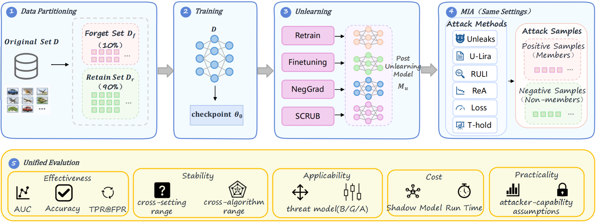
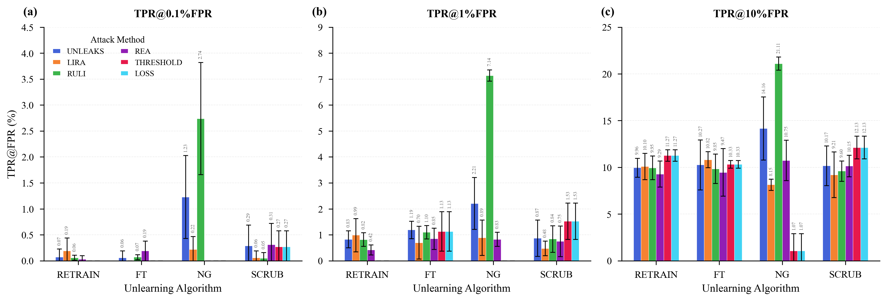
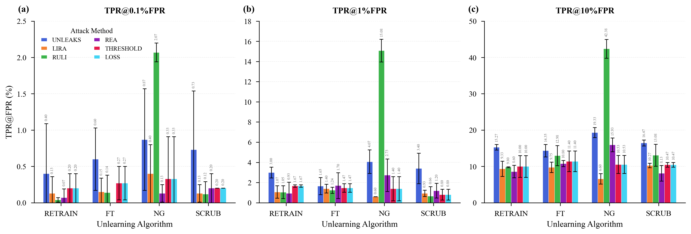
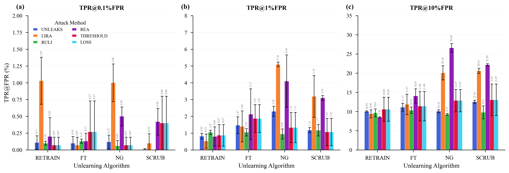
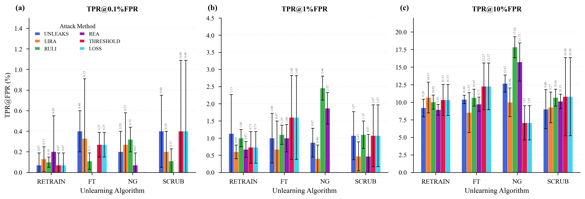
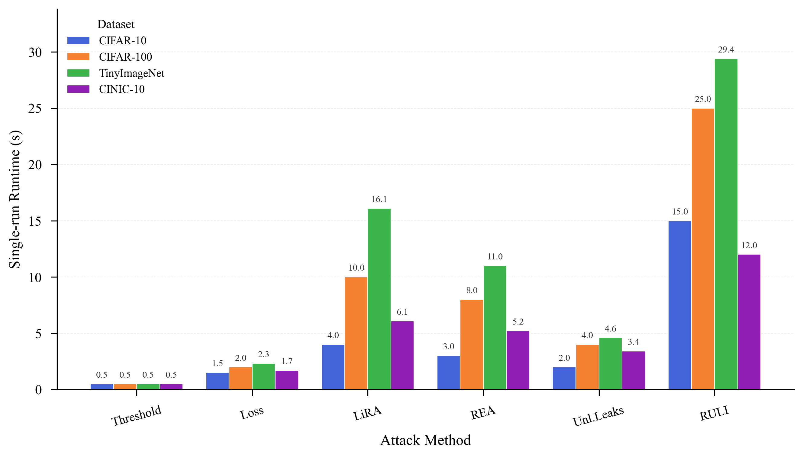

<div align="center">

# 🔍 MIA-Bench

**Benchmarking Membership Inference Attacks on Machine Unlearning**

[](LICENSE)
[](https://www.python.org/)
[](https://pytorch.org/)
[](https://ieeexplore.ieee.org/xpl/RecentIssue.jsp?punumber=69)
[](.github/workflows/ci.yml)
[](https://github.com/keke2510/MIA-benchmark/stargazers)
[](https://github.com/keke2510/MIA-benchmark/network/members)

*"The right to be forgotten" is only as strong as our ability to verify it.*

</div>

Machine unlearning promises to erase the influence of training data on demand — but how do we know it actually worked? **MIA-Bench** answers this question by providing a rigorous, standardized, and reproducible framework for measuring residual privacy leakage in unlearned models through **membership inference attacks (MIAs)**.

Instead of relying on a single metric or a single attack, MIA-Bench evaluates attacks across **five complementary dimensions** — **E**ffectiveness, **S**tability, **A**pplicability, **C**ost, and **P**racticality — over **288 systematic experiments** (6 attacks × 4 unlearning algorithms × 4 datasets × 3 seeds).

<p align="center">
  
  <br>
  <em>Five-dimensional evaluation profiles of the six attack methods (min-max normalized). No single attack dominates all dimensions.</em>
</p>

> 📄 **Paper**: *MIA-Bench: Benchmarking Membership Inference Attacks on Machine Unlearning* — submitted to IEEE TKDE (CCF-A).

---

## 🎯 Why MIA-Bench?

Existing MIA-on-unlearning studies are hard to compare — they use different forgetting ratios, shadow-model counts, attack implementations, and metrics. MIA-Bench fixes this with a unified, multi-dimensional protocol:

| Dimension | Prior Work | **MIA-Bench** |
|-----------|-----------|---------------|
| Attacks evaluated | 1–3 per study | **6** (black-box → gray-box → algorithm-specific) |
| Evaluation dimensions | 1–2 (mostly E, A) | **5** — E / S / A / C / P |
| Datasets | 2–7, study-specific | **4** standardized (CIFAR-10/100, TinyImageNet, CINIC-10) |
| Protocol | Heterogeneous | **Fixed** 10% forget ratio, 3 seeds, 8 shadow models |

---

## ✨ Highlights

- 🧭 **Five-dimensional evaluation** — Effectiveness, Stability, Applicability, Cost, Practicality
- ⚔️ **6 attack methods** — LiRA, REA, RULI, UnlearningLeaks + Threshold / Loss baselines
- 🧩 **4 unlearning algorithms** — Retrain, Finetuning, NegGrad, SCRUB
- 📦 **4 benchmark datasets** — CIFAR-10, CIFAR-100, TinyImageNet, CINIC-10
- 🔢 **288 experimental settings** — 6 attacks × 4 algorithms × 4 datasets × 3 seeds
- 🔌 **Unified registry-based API** — extensible to new attacks and unlearning methods
- 📊 **Automated multi-dimensional reporting** — AUC, Accuracy, TPR@FPR, σ, CV, runtime

---

## 📋 Table of Contents

- [Supported Attacks](#-supported-attacks)
- [Supported Unlearning Algorithms](#-supported-unlearning-algorithms)
- [Evaluation Framework](#-evaluation-framework)
- [Installation](#-installation)
- [Quick Start](#-quick-start)
- [Usage](#-usage)
- [Repository Structure](#-repository-structure)
- [Key Results](#-key-results)
- [Reproducibility](#-reproducibility)
- [Citation](#-citation)
- [License](#-license)
- [Contributing](#-contributing)
- [Acknowledgements](#-acknowledgements)

---

## ⚔️ Supported Attacks

| Attack | Threat Model | Primary Signal | Paper |
|--------|-------------|----------------|-------|
| **LiRA** | Gray-box (shadow models) | Per-sample confidence distribution | Carlini et al., IEEE S&P 2022 |
| **REA** (Reminiscence Attack) | Algorithm-specific | Residual parameter gradients | Xiao et al., ICCV 2025 |
| **RULI** | Gray-box (shadow models) | Population-level likelihood inference | Naderloui et al., USENIX Security 2025 |
| **UnlearningLeaks** | Algorithm-specific | Pre/post-unlearning posterior divergence | Chen et al., ACM CCS 2021 |
| **Threshold** (baseline) | Black-box | Prediction confidence thresholding | Shokri et al., IEEE S&P 2017 |
| **Loss** (baseline) | Black-box | Per-sample loss values | Yeom et al., IEEE CSF 2018 |

## 🧩 Supported Unlearning Algorithms

| Algorithm | Type | Description |
|-----------|------|-------------|
| **Retrain** | Exact (gold standard) | Train from scratch on the retain set only |
| **Finetuning** | Approximate | Fine-tune on the retain set for a few epochs |
| **NegGrad** | Approximate | Gradient ascent on the forget set + descent on the retain set |
| **SCRUB** | Approximate | Teacher-student distillation with selective obedience |

## 📏 Evaluation Framework

MIA-Bench evaluates each attack along five complementary dimensions:

| Dimension | Key Question | Representative Metrics |
|-----------|--------------|------------------------|
| **E**ffectiveness | How well does the attack identify forgotten members? | AUC, Accuracy, TPR@FPR |
| **S**tability | How consistent is the attack across conditions? | Std (σ), Coefficient of Variation (CV) |
| **A**pplicability | What threat model and knowledge are required? | Knowledge prerequisites, shadow models |
| **C**ost | What are the computational and query overheads? | Runtime, query budget, storage |
| **P**racticality | Does it translate to real deployment? | TPR@low-FPR under realistic constraints |

---

## 🏗️ Architecture

MIA-Bench follows a five-stage pipeline — from data partitioning to multi-dimensional analysis:

<p align="center">
  
</p>

---

## 🛠 Installation

### Prerequisites

- Python 3.8+
- PyTorch 1.10+ with CUDA
- NVIDIA RTX 3090 (24 GB) or better recommended

### Option 1: pip

```bash
git clone https://github.com/keke2510/MIA-benchmark.git
cd MIA-benchmark
pip install -r requirements.txt
```

### Option 2: Conda (recommended for reproducibility)

```bash
git clone https://github.com/keke2510/MIA-benchmark.git
cd MIA-benchmark
conda env create -f environment.yml
conda activate mia-bench
```

### Option 3: Docker

```bash
docker build -t mia-bench .
docker run --gpus all -it mia-bench
```

---

## 🚀 Quick Start

### Run a single experiment

```bash
python run_benchmark.py \
  --dataset Cifar10 \
  --seed 1 \
  --methods finetune \
  --attacks lira rea \
  --stages pretrain shadow unlearn reminiscence attack
```

### Run all six attacks on one unlearning method

```bash
python run_benchmark.py \
  --dataset Cifar10 \
  --seed 1 \
  --methods finetune \
  --attacks lira rea ruli unlearningleaks threshold loss \
  --stages unlearn attack
```

### Preview commands without executing

```bash
python run_benchmark.py \
  --dataset Cifar10 \
  --seed 1 \
  --methods finetune \
  --attacks lira rea ruli unlearningleaks \
  --dry-run
```

### Reproduce the full benchmark matrix

```bash
python run_full_experiment.py --dry-run   # preview the 288-setting matrix
python run_full_experiment.py             # run the full benchmark
```

---

## 📖 Usage

### CLI Reference

```
--dataset       Cifar10 | Cifar100 | TinyImageNet | Cinic10
--methods       retrain | finetune | negative_grad | scrub   (or method:para1:para2)
--attacks       lira | rea | ruli | unlearningleaks | threshold | loss
--stages        pretrain shadow unlearn reminiscence attack
--seed         <int>
--forget-perc  0.1
--num-shadow   8
--num-aug      10
--dry-run
```

### Pipeline Stages

| Stage | Description |
|-------|-------------|
| `pretrain` | Train the base target model on the full training set |
| `shadow` | Train reusable shadow models for LiRA / RULI |
| `unlearn` | Apply the chosen unlearning algorithm |
| `reminiscence` | REA-specific: fine-tune on the retain set to amplify residual signals |
| `attack` | Run selected MIA methods and collect metrics |

### Attack-specific Options

**RULI** (population-level inference):

```bash
--ruli-task selective
--ruli-shadow-num 8
--ruli-train-shadow-mode auto
```

**UnlearningLeaks** (posterior divergence):

```bash
--unlearningleaks-feature direct_diff
--unlearningleaks-attack-model lr
--unlearningleaks-num-shadow 8
```

---

## 📁 Repository Structure

```
mia-benchmark-main/
├── run_benchmark.py              # Main benchmark entry point
├── run_full_experiment.py        # Full 288-setting experiment matrix
├── run_supplementary.py          # Supplementary experiments
├── measure_runtime.py            # Per-attack runtime profiling
├── benchmark/                    # Dataset presets, stage orchestration, attack dispatch
├── attacks/                      # Attack method adapters (registry-based)
│   ├── registry.py               # Attack registry
│   ├── base.py                   # AttackContext / AttackResult
│   ├── lira.py  rea.py  ruli.py  unlearningleaks.py
│   └── threshold.py  loss.py     # Black-box baselines
├── evaluation/                   # Multi-dimensional metrics (effectiveness, stability, cost, realism)
├── models/                       # Model architectures (ResNet, ViT)
├── datasets/                     # Dataset loaders (CIFAR-10/100, TinyImageNet, CINIC-10)
├── forget_random_strategies.py   # Unlearning algorithm implementations
├── Ruli/                         # RULI attack engine (third-party)
├── thirdparty/                   # Third-party dependencies
├── scripts/                      # Batch experiment scripts & figure plotting
├── assets/                       # README figures
├── config.py                     # Global configuration
└── utils/                        # Training and evaluation utilities
```

---

## 📈 Key Results

MIA-Bench reveals substantial and previously under-measured variation in residual privacy leakage:

- **Algorithm choice is a first-order privacy decision** — attack AUC ranges from **0.519** (Retrain, the gold standard) to **0.704** (NegGrad), a **36%** relative difference.
- **No single attack dominates all dimensions** — RULI attains the highest peak accuracy (**70.41%** on CIFAR-100 NegGrad) but exhibits the widest cross-setting variation (**20.53 pp**); LiRA and UnlearningLeaks provide the most stable measurements.
- **Global metrics overestimate practical risk** — under a controlled low false-positive rate (FPR = 1%), the strongest attack identifies only **15.1%** of forgotten members, a ~5× drop from global accuracy.
- **Computational cost spans ~60×** — from <1 minute (Threshold / Loss) to ≈1 hour (LiRA with 8 shadow models).

### Attack Performance Under Low-FPR Constraints

The TPR@FPR analysis shows how attack effectiveness collapses under realistic false-positive constraints — a phenomenon that global AUC hides:

<p align="center">
  
  
  
  
</p>

### Computational Cost

Single-run runtime spans two orders of magnitude across attacks — from sub-second black-box baselines to tens of seconds for shadow-model-based attacks:

<p align="center">
  
</p>

The full experimental results, detailed tables, and analysis are available in the paper.

---

## 🔬 Reproducibility

- **Forgetting ratio** is fixed at **10%** to eliminate a known confounding factor.
- All experiments use **fixed random seeds** (42, 123, 999) and are repeated **3 times**; results are reported as mean ± std.
- **8 shadow models** are used consistently across gray-box attacks (LiRA, RULI) and REA.
- **Hardware**: NVIDIA RTX 3090 (24 GB), AMD Ryzen 9 5950X, 64 GB RAM; Ubuntu 20.04, Python 3.8, PyTorch 1.10.2, CUDA 11.3.

---

## 📚 Citation

If you find MIA-Bench useful in your research, please cite:

```bibtex
@article{liu2026miabench,
  title={MIA-Bench: Benchmarking Membership Inference Attacks on Machine Unlearning},
  author={Liu, Shang and Hu, Jingchao and Yang, Zhan and Li, Yonggang and Yuan, Guan and Liu, Jinfei and Cao, Yang},
  journal={IEEE Transactions on Knowledge and Data Engineering},
  year={2026},
  note={Under review}
}
```

---

## 📄 License

This project is released under the [MIT License](LICENSE).

---

## 🤝 Contributing

We welcome contributions! Please see [CONTRIBUTING.md](CONTRIBUTING.md) for guidelines on reporting issues, submitting pull requests, and adding new attacks or unlearning methods.

---

## 🙏 Acknowledgements

MIA-Bench builds upon several open-source projects, including [LiRA](https://github.com/tensorflow/privacy), [REA](https://github.com/xiaoxiang123/REA), [RULI](https://github.com/naderloui/Ruli), and [UnlearningLeaks](https://github.com/chenming1999/UnlearningLeaks). We thank the authors for making their code publicly available.
