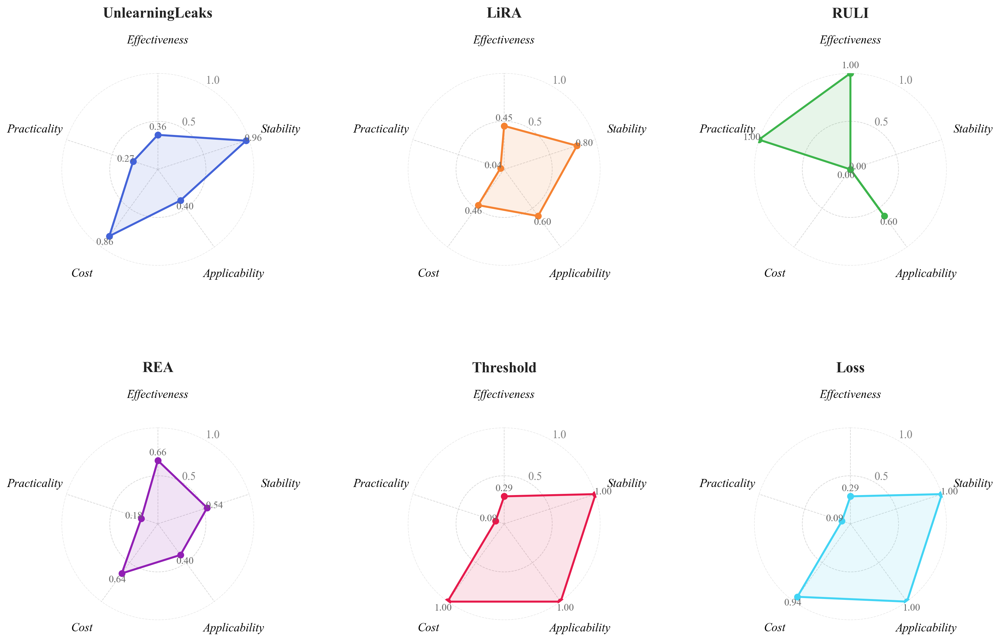

# MIA-Bench

**面向机器遗忘的成员推断攻击基准评测框架**

[](https://ieeexplore.ieee.org/xpl/RecentIssue.jsp?punumber=69)

MIA-Bench 是一个面向机器遗忘场景的成员推断攻击（MIA）综合基准评测框架。它建立了标准化的五维评估协议——**有效性（E）**、**稳定性（S）**、**适用性（A）**、**成本（C）** 和 **实用性（P）**——并将代表性攻击方法、遗忘算法和数据集整合到统一的、可复现的平台中。

> 📄 **论文**：已投稿 IEEE TKDE（CCF-A）

<p align="center">
  
  <br>
  <em>六种攻击方法的五维评估雷达图（min-max 归一化）——没有任何一种攻击能在所有维度上占优。</em>
</p>

---

## 核心特性

- **五维评估体系**：有效性、稳定性、适用性、成本、实用性
- **6 种攻击方法**：LiRA、REA、RULI、UnlearningLeaks + Threshold、Loss 基线
- **4 种遗忘算法**：Retrain、Finetuning、NegGrad、SCRUB
- **4 个基准数据集**：CIFAR-10、CIFAR-100、TinyImageNet、CINIC-10
- **288 组实验设置**覆盖所有维度
- **统一 API** 接口，支持攻击方法和遗忘算法的灵活扩展
- **自动化多维报告**：AUC、Accuracy、TPR@FPR、σ、CV、运行时间

---

## 支持的攻击方法

| 攻击 | 威胁模型 | 核心信号 | 出处 |
|------|---------|---------|------|
| **LiRA** | 灰盒（影子模型） | 逐样本置信度分布 | Carlini et al., IEEE S&P 2022 |
| **REA**（回忆攻击） | 算法特定 | 参数残差梯度 | Xiao et al., ICCV 2025 |
| **RULI** | 灰盒（影子模型） | 群体级似然推断 | Naderloui et al., USENIX Security 2025 |
| **UnlearningLeaks** | 算法特定 | 遗忘前后后验散度 | Chen et al., ACM CCS 2021 |
| **Threshold**（基线） | 黑盒 | 置信度阈值 | Shokri et al., IEEE S&P 2017 |
| **Loss**（基线） | 黑盒 | 单样本损失值 | Yeom et al., IEEE CSF 2018 |

## 支持的遗忘算法

| 算法 | 类型 | 描述 |
|------|------|------|
| **Retrain** | 精确遗忘（金标准） | 在保留集上从头重训 |
| **Finetuning** | 近似遗忘 | 在保留集上微调少量 epoch |
| **NegGrad** | 近似遗忘 | 遗忘集梯度上升 + 保留集梯度下降 |
| **SCRUB** | 近似遗忘 | 教师-学生蒸馏，选择性服从 |

## 代码结构

```
mia-benchmark-main/
├── run_benchmark.py              # 主 Benchmark 入口
├── benchmark/samplewise.py       # 数据集预设、阶段编排、攻击调度
├── attacks/                      # 攻击方法适配器
├── evaluation/                   # 多维评估指标
├── models/                       # 模型架构（ResNet, ViT）
├── datasets/                     # 数据加载器
├── forget_random_strategies.py   # 遗忘算法实现
├── Ruli/                         # RULI 攻击引擎
├── scripts/                      # 批量实验脚本
├── config.py                     # 全局配置
└── utils/                        # 训练和评估工具
```

---

## 快速开始

### 环境要求

- Python 3.8+
- PyTorch 1.10+ with CUDA
- RTX 3090 或更高（推荐 24GB+ 显存）

```bash
pip install -r requirements.txt
```

### 运行单个实验

```bash
python run_benchmark.py \
  --dataset Cifar10 \
  --seed 1 \
  --methods finetune \
  --attacks lira rea \
  --stages pretrain shadow unlearn reminiscence attack
```

### 对所有攻击评估一种遗忘方法

```bash
python run_benchmark.py \
  --dataset Cifar10 \
  --seed 1 \
  --methods finetune \
  --attacks lira rea ruli unlearningleaks threshold loss \
  --stages unlearn attack
```

---

## 评估指标

### 有效性
- AUC、Accuracy、TPR@FPR（0.1%, 1%, 10%）

### 稳定性
- 标准差（σ）跨 3 个随机种子
- 变异系数（CV）跨数据集和算法

### 成本
- 训练时间、查询预算、存储

---

## 引用

```bibtex
@article{liu2026miabench,
  title={MIA-Bench: Benchmarking Membership Inference Attacks on Machine Unlearning},
  author={Liu, Shang and Hu, Jingchao and Yang, Zhan and Li, Yonggang and Liu, Jinfei and Cao, Yang},
  journal={IEEE Transactions on Knowledge and Data Engineering},
  year={2026},
  note={Under review}
}
```

## 许可证

本项目基于 [MIT License](LICENSE) 开源。
